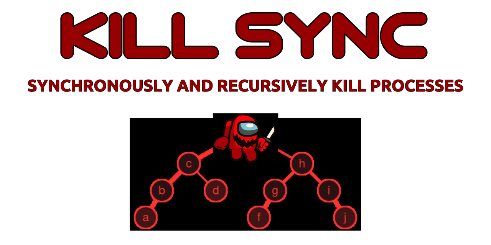

<div align="center">

# [](https://github.com/nktnet1/kill-sync)

[](https://github.com/nktnet1/kill-sync/actions/workflows/pipeline.yml)
&nbsp;
[](https://codecov.io/gh/nktnet1/kill-sync)
&nbsp;
[](https://codeclimate.com/github/nktnet1/kill-sync/maintainability)
&nbsp;
[](https://snyk.io/test/github/nktnet1/kill-sync)
&nbsp;
[](https://github.com/search?q=repo%3Anktnet1%2Fkill-sync++language%3ATypeScript&type=code)

[](https://www.npmjs.com/package/kill-sync?activeTab=versions)
&nbsp;
[](https://packagephobia.com/result?p=kill-sync)
&nbsp;
[](https://depfu.com/github/nktnet1/kill-sync?project_id=39387)
&nbsp;
[](https://opensource.org/license/mit/)
&nbsp;
[](https://github.com/nktnet1/kill-sync/issues)

[](https://sonarcloud.io/summary/new_code?id=nktnet1_kill-sync)
&nbsp;
[](https://app.codacy.com/gh/nktnet1/kill-sync/dashboard?utm_source=gh&utm_medium=referral&utm_content=&utm_campaign=Badge_grade)
&nbsp;
[](https://app.deepsource.com/gh/nktnet1/kill-sync/)
&nbsp;
[](https://codebeat.co/projects/github-com-nktnet1-kill-sync-main)
&nbsp;
[](https://github.com/nktnet1/kill-sync/stargazers)

[](https://moiva.io/?npm=kill-sync)
&nbsp;
[](https://moiva.io/?npm=kill-sync)
&nbsp;
[](https://moiva.io/?npm=kill-sync)
&nbsp;
[](https://moiva.io/?npm=kill-sync)
&nbsp;
[](https://moiva.io/?npm=kill-sync)

---


Synchronously kill processes based on their pid

Supports treekill, where child processes are recursively terminated

</div>

---

- [1. Installation](#1-installation)
- [2. Usage](#2-usage)
- [3. License](#3-license)
- [4. Limitations](#4-limitations)
- [5. Caveats](#5-caveats)

## 1. Installation

```
npm install kill-sync
```

## 2. Usage

Try with [Replit](https://replit.com/@nktnet1/kill-sync-example#index.js).

```javascript
killSync(pid)
killSync(pid, signal)
killSync(pid, signal, recursive)
```
- **`pid`**: a number denoting the [process identifier](https://en.wikipedia.org/wiki/Process_identifier)
- **`signal`**: [inter-process communication signals](https://en.wikipedia.org/wiki/Signal_(IPC)). Default: `'SIGTERM'` (`15`)
- **`recursive`**: boolean to enable tree-killing child processes. Default: `false`

Example 1: kill a process with `SIGTERM`
```javascript
const killSync = require('kill-sync');
killSync(31842840);
```

Example 2: kill a process with `SIGINT`
```javascript
const killSync = require('kill-sync');
killSync(5313514, 'SIGINT');
```

Example 3: kill a process with `SIGINT` recursively
```javascript
const killSync = require('kill-sync');
killSync(315230, 'SIGINT', true);
```


## 3. License

<details closed>
<summary>
  Massachusetts Institute of Technology
  (<a href="https://opensource.org/license/mit" target="_blank">MIT</a>)
</summary>

<br/>

```
Copyright (c) 2023 Khiet Tam Nguyen

Permission is hereby granted, free of charge, to any person obtaining a
copy of this software and associated documentation files (the “Software”),
to deal in the Software without restriction, including without limitation
the rights to use, copy, modify, merge, publish, distribute, sublicense,
and/or sell copies of the Software, and to permit persons to whom the
Software is furnished to do so, subject to the following conditions:

The above copyright notice and this permission notice shall be included in
all copies or substantial portions of the Software.

THE SOFTWARE IS PROVIDED “AS IS”, WITHOUT WARRANTY OF ANY KIND, EXPRESS OR
IMPLIED, INCLUDING BUT NOT LIMITED TO THE WARRANTIES OF MERCHANTABILITY,
FITNESS FOR A PARTICULAR PURPOSE AND NONINFRINGEMENT. IN NO EVENT SHALL
THE AUTHORS OR COPYRIGHT HOLDERS BE LIABLE FOR ANY CLAIM, DAMAGES OR OTHER
LIABILITY, WHETHER IN AN ACTION OF CONTRACT, TORT OR OTHERWISE, ARISING
FROM, OUT OF OR IN CONNECTION WITH THE SOFTWARE OR THE USE OR OTHER
DEALINGS IN THE SOFTWARE.
```

</details>

## 4. Limitations

There are currently no known limitations.

## 5. Caveats

**kill-sync** is modelled after [tree-kill](https://github.com/pkrumins/node-tree-kill) and [tree-kill-sync](https://github.com/dvpnt/tree-kill-sync).
